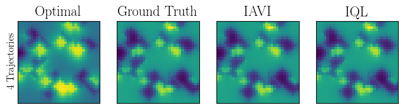
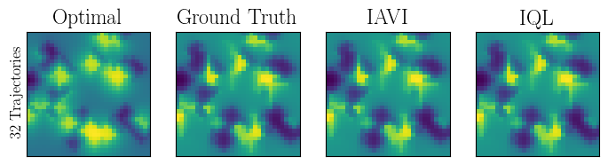
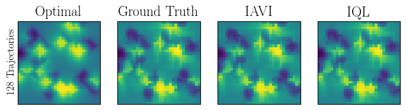
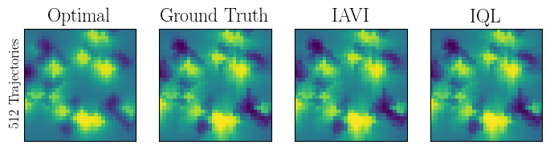

# Deep Inverse Q-learning with Constraints

This repository is the official implementation of [Deep Inverse Q-learning with Constraints](https://arxiv.org/abs/2008.01712). 


Arxiv : [https://arxiv.org/abs/2008.01712](https://arxiv.org/abs/2008.01712)

Blog Post: [http://nrprojects.cs.uni-freiburg.de/foundations.html#inverse](http://nrprojects.cs.uni-freiburg.de/foundations.html#inverse)


Abstract: Popular Maximum Entropy Inverse Reinforcement Learning approaches require the computation of expected state visitation frequencies for the optimal policy under an estimate of the reward function. This usually requires intermediate value estimation in the inner loop of the algorithm, slowing down convergence considerably. 
In this work, we introduce a novel class of algorithms that only needs to solve the MDP underlying the demonstrated behavior *once* to recover the expert policy. This is possible through a formulation that exploits a probabilistic behavior assumption for the demonstrations within the structure of Q-learning. We propose Inverse Action-value Iteration which is able to fully recover an underlying reward of an external agent in *closed-form* analytically. We further provide an accompanying class of sampling-based variants which do not depend on a model of the environment. We show how to extend this class of algorithms to continuous state-spaces via function approximation and how to estimate a corresponding action-value function, leading to a policy as close as possible to the policy of the external agent, while optionally satisfying a list of predefined hard constraints. We evaluate the resulting algorithms called Inverse Action-value Iteration, Inverse Q-learning and Deep Inverse Q-learning on the Objectworld benchmark, showing a speedup of up to several orders of magnitude compared to (Deep) Max-Entropy algorithms. We further apply Deep Constrained Inverse Q-learning on the task of learning autonomous lane-changes in the open-source simulator SUMO achieving competent driving after training on data corresponding to 30 minutes of demonstrations.

## Requirements

To install requirements:

```setup
pip install -r requirements.txt
```

>📋 Please use Python 3.7. 

## Training

To train IAVI and IQL, run  *train.sh*:

```train
#!/bin/bash
# train.sh

cd src/
	
# collect data for 4, 32, 128 and 512 trajectories in the Objectworld environment.
python collect_data.py 4 32 128 512

# train iavi and iql for the above specified number of trajectories.
for i in 4 32 128 512
do
	python train.py iavi $i
	python train.py iql $i 100
done
```

By default, IQL is trained for 100 epochs and IAVI until a threshold of 0.01 is reached.
All following steps can be executed for 4, 32, 128 and 512 transitions with the bash script. Details:


#### 1. Collect trajectories in the Objectworld environment 

```train
python collect_data.py  n_traj1 n_traj2 
```
The arguments n\_traj1, n\_traj2 specify the number of trajectories data should be collected for. 


#### 2. Train IAVI and IQL

```train
python src/train.py alg n_traj [n_epochs]
```

The argument alg is either "iavi" or "iql" and n\_traj the number of trajectories. For IQL, the number of epochs has to be specified with n\_epochs.


## Evaluation

To evaluate the experiments, run *evaluate.sh*:

```eval
#!/bin/bash
# evaluate.sh

cd src/

# evaluate iavi and iql for the specified number of trajectories.
for i in 4 32 128 512
do
    python src/plot_experiments.py $i
done
```
All following steps can be executed with the bash-script. Details:

####  Plot results
```console
python src/plot_experiments.py n_traj
```

The argument n\_traj is the number of trajectories.


## Results


The results are stored in the path *results/*.

<br/>
<br/>
<br/>


Content of *result.csv*:


| Trajectories | EVD IAVI      | EVD IQL |  Runtime IAVI [h]   | Runtime IAVI [h] |
| -----------  | ----------- | ----------- | ----------- | ----------- |
|4.0				   | 15.312				| 15.36			  | 0.012				| 0.0				  |
|32.0 			   | 8.817 			  | 15.092  	   | 0.018 			   | 0.0 			  |
|128.0 			   | 2.606 			  | 11.853 			  | 0.021			  | 0.001 			  |
|512.0 			   | 2.045 			  | 3.289 			  | 0.022 			  | 0.004 			  |

## Contributing

>📋  Awesome that you are interested in our work! Please write an e-mail to {kalweitg, hueglem}@cs.uni-freiburg.de
